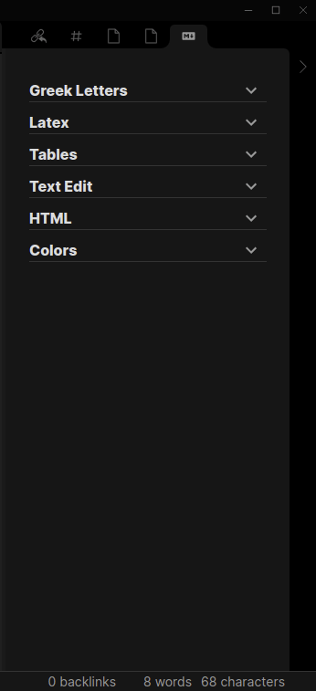
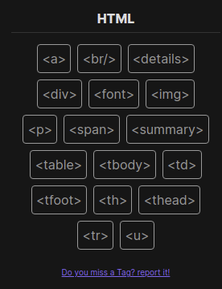
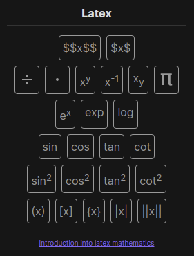
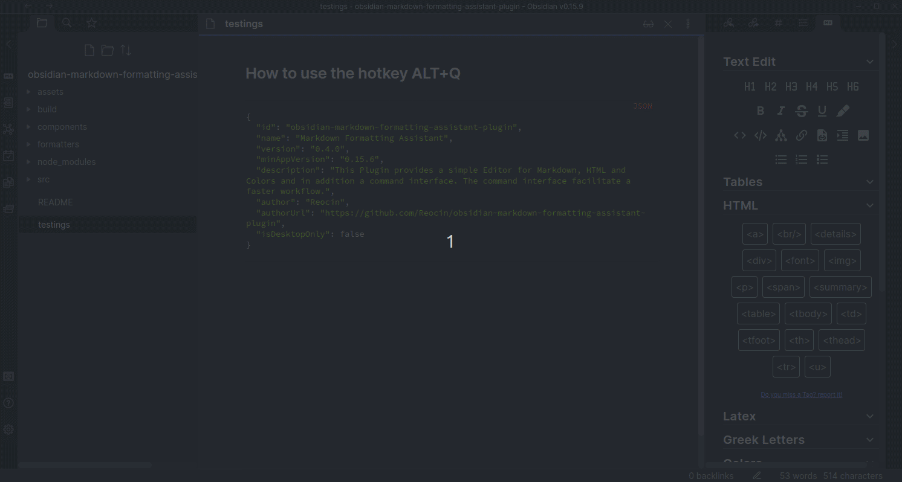
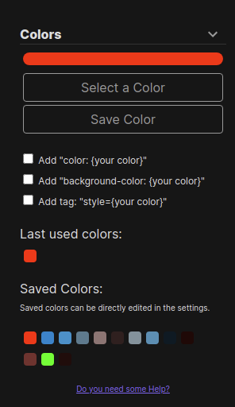

> # PLUGIN NOT MAINTAINED anymore
>THIS IS JUST A FORK 
i added tabulation and colors support. maybe in future will add more according to my needs.

----
# Obsidian Markdown Formatting Assistant

> This Plugin provides easy to use snippets for Markdown, HTML and Latex and a color picker which shows the history of last used colors. Furthermore, it is possible to save any color you want.
> Version 0.4.0

> If you find a Bug or have a feature request: https://github.com/Reocin/obsidian-markdown-formatting-assistant-plugin/issues

## Side Panel

The Side Panel can be opened by the Ribbon Icon on the left side. If you changed the side (left or right) of the panel in the settings, just hit this butten/icon again and it will reload on the right side.

### Order and expansion of the Sections

It is possible to change the order of the sections according to the personal wishes. Furthermore it is possible to expand and shrink every section to keep the overview.

### Markdown Section

### HTML Section

### Latex Section

> Latex Functions only work if they are in a latex equation section like $...$ or $$...$$.

### Greek Letters Section

> Greek Letters only work if they are in a latex equation section like $...$ or $$...$$.

### Callouts Section

## Suggestion Window with Shortcut

This plugin does have a default shortcut `ALT+Q` which opens a Suggestion Window with all commands of this plugin (except colors and callouts). Once you get used to it, you want never miss it again. Furthermore, this way there is no need to ever leave your keyboard!

With the default shortcut `ALT-C` a Suggestion Window for Callouts is opened with the same functionality like the common Suggestion Window.

### How it works
Just press the shortcut/hotkey `ALT+Q` on any place. It doesn't matter if you are on a specific position or selected some text you want to change. Then enter the name of the command you want to apply. After a few letters your wished command should be suggested in the top 5.

### How to change the shortcut/hotkey

The shortcut/hotkey `ALT+Q` was selected becaus it can be  comfortable reached with just one hand, but you can change it to what ever you want.

## Color Picker

### Select a color

The color picker provides an easy and fast workflow to work with colors. If you pick a color with the `Select a Color` button and leave the window (by clicking outside the color picker), the selected color will be inserted at the current courser position. In addition, it will be copied to the clipboard.

### Color History

Furthermore, the color picker saves the history of the last 10 used colors.

### Saved Colors

To Save the current color even if obsidian will be closed, just click the `Save Color` button.

### Sort saved Colors

All saved colors can be sorted via drop a catch.

### Delete a Color

To delete a saved or last used color just click it with the right mouse button.

### Additional Formats

For a even easier handling you can select additional options to what should be added to the color.

#### Options

- Add "color: {your color}"
  - ex. `color: #ffffff`
- Add "background-color: {your color}
  - ex. `background-color: #ffffff`
- Add tag: "style={your color}
  - This option is only helpful, if you also select one of both of the other options like:
  - ex. `style="background-color: #ff0000"`

## Settings

- Side Pane Side

  - default: right
  - options: right, left
  - Defines the side of the side pane. By default the side pane will open on the right side/leaf.

- Saved Colors
  - default: ""
  - options: any hex color. One hex (#ffffff) color per line.
  - Manages the saved colors. Colors can be added, deleted, edited. The order is also considered.

## Changelog
- Version: 0.4.1
  - Added Callouts-Support
- Version: 0.4.0
  - Updated the plugin to the new Obsidian API 0.15.x
  - Replace command language with a suggestion window triggered by a hotkey
  - Fixed the wrong courser position after use of the header buttons/command (h1,h2, ...)
- Version: 0.3.2
  - Additional options for the color picker
  - New Highlight Button in the Text Edit section and command line
- Version 0.3.1
  - Changeable order of the sections
  - Expandable sections
  - Corrected the latex `\$\$` and `\$\$\$\$` buttons as they were switched
- Version 0.3.0
  - added a Latex and Greek Letters section
- Version 0.2.2
  - added /mermaid snipplet to generate mermaid code block - allows drawing diagrams 
- Version 0.2.1
  ⁻ Some Bug Fixes
  - No input preview mode
  - Highlighting of the html buttons when hover
  - Replace selection when insert colors.
  - Saved Colors can be added and edited in the settings.
  - New HTML Tags `

` and `

`
- Vesion 0.2.0
  - Added support for HTML snippets in command language and in side pane.
  - Added a color picker
- Vesion 0.1.2
  - Inital plugin
